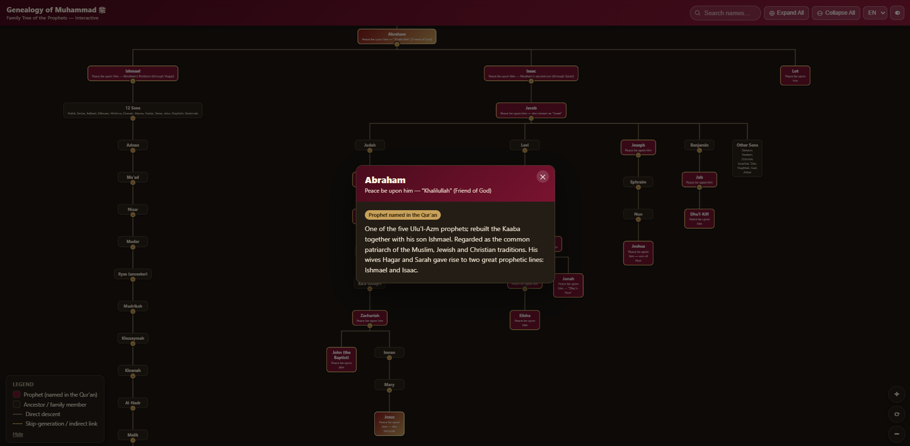
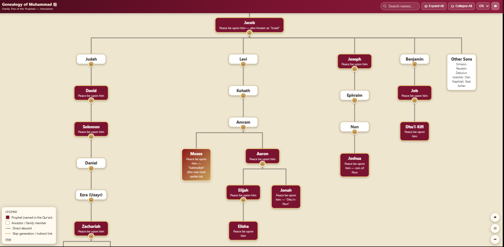

# Şecere-i Peygamberî — İnteraktif Soy Ağacı

Âdem'den Hz. Muhammed'e (s.a.v.) kadar peygamberler soy ağacının interaktif, tek dosyalık web uygulaması. "Family Tree of the Prophets" (İngilizce şema) ve "Şecere-i Muhammedî" (Türkçe poster) kaynaklarının sentezlenmesiyle hazırlandı.

**Canlı site:** https://hucremcom.github.io/peygamberler-soy-agaci/

## Özellikler

- Türkçe / İngilizce dil seçeneği
- İsme göre anlık arama ve ilgili düğüme zıplama
- Dokunmatik pinch-zoom, fare tekerleği ile yakınlaştırma, sürükleyerek kaydırma
- Dallara tıklayarak açma/kapama, "Tümünü Aç / Tümünü Kapat"
- Her kişiye tıklayınca kısa bilgi kartı (Kur'an'da adı geçen peygamberler ayrıca işaretli)
- Açık/koyu tema desteği
- Tamamen çevrimdışı çalışır — tek HTML dosyası, harici bağımlılık yok

## Kullanım

`index.html` dosyasını herhangi bir tarayıcıda açmanız yeterli. İnternet bağlantısı gerekmez.

## Kaynaklar

- `pegamberler-soy-agaci.jpg`, `pegamberler-soy-agaci.pdf` — Türkçe "Şecere-i Muhammedî" posteri (kaynak görsel)
- `ETpuGSJWoAAjx3k.jpg`, `h7zrv7a2rpyb1.jpg` — "Family Tree of the Prophets" (İngilizce şema, kaynak görsel)

## Not

Bazı çok eski ata isimlerinin sıralaması (ör. Sam soyundaki ataların tam sırası) kaynaklara göre hafif farklılık gösterebilir; ana peygamber hattı ve ilişkiler kesindir. Detaylar için her kutunun bilgi kartına bakınız.

## Ekran Görüntüleri

Uygulamanın genel görünümü ve interaktif kullanımı:

---

# Family Tree of the Prophets — Interactive Tree

An interactive, single-file web application of the family tree of the prophets from Adam to Prophet Muhammad (peace be upon him). It was created by synthesizing the "Family Tree of the Prophets" (English chart) and "Şecere-i Muhammedî" (Turkish poster) sources.

**Live site:** https://hucremcom.github.io/peygamberler-soy-agaci/

## Features

- Turkish / English language selection
- Instant search by name and jump to the relevant node
- Touch pinch-zoom, mouse wheel zoom, drag to pan
- Expand/collapse branches by clicking, "Expand All / Collapse All"
- Clicking a person shows a short info card (prophets mentioned in the Quran are additionally marked)
- Light/dark theme support
- Fully offline — a single HTML file with no external dependencies

## Usage

Just open the `index.html` file in any browser. No internet connection required.

## Sources

- `pegamberler-soy-agaci.jpg`, `pegamberler-soy-agaci.pdf` — Turkish "Şecere-i Muhammedî" poster (source image)
- `ETpuGSJWoAAjx3k.jpg`, `h7zrv7a2rpyb1.jpg` — "Family Tree of the Prophets" (English chart, source image)

## Note

The order of some very old ancestor names (e.g., the exact sequence of ancestors in the line of Shem) may differ slightly across sources; the main prophetic line and relationships are definitive. See each box's info card for details.

## Screenshots

Overall view of the application and its interactive usage:

